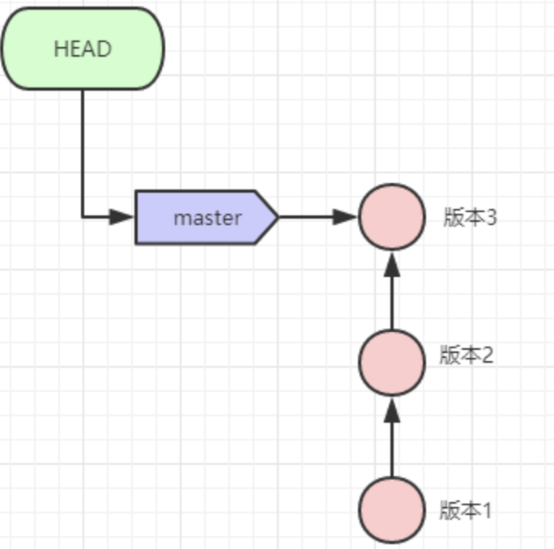
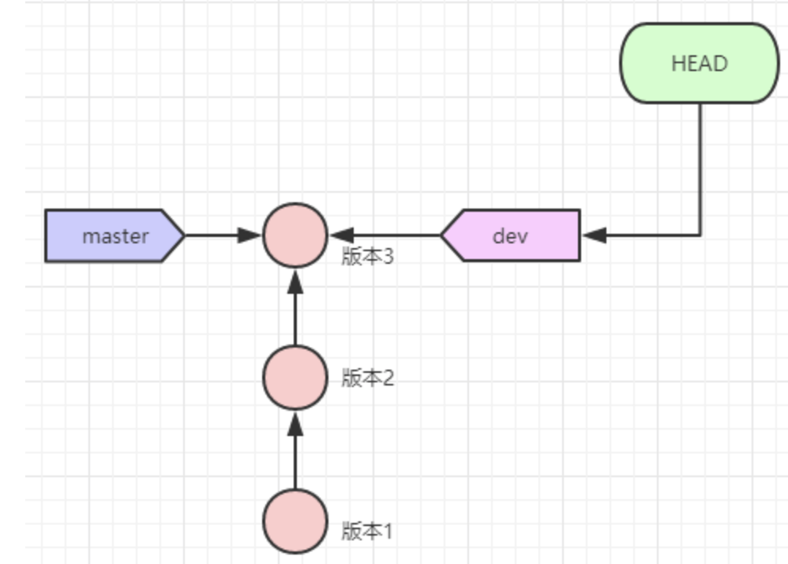
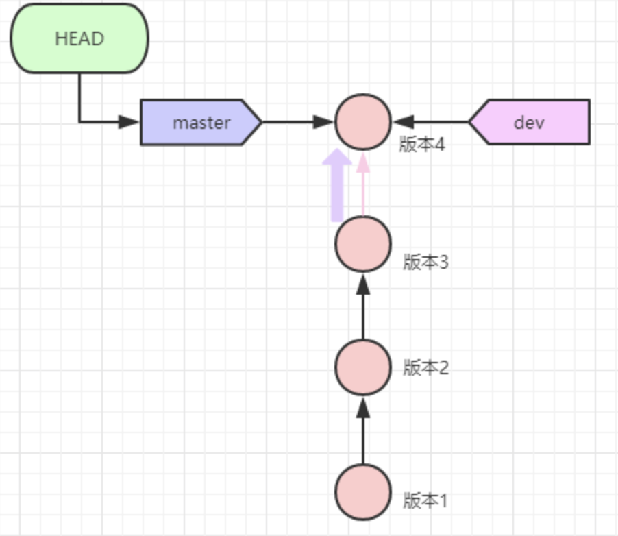
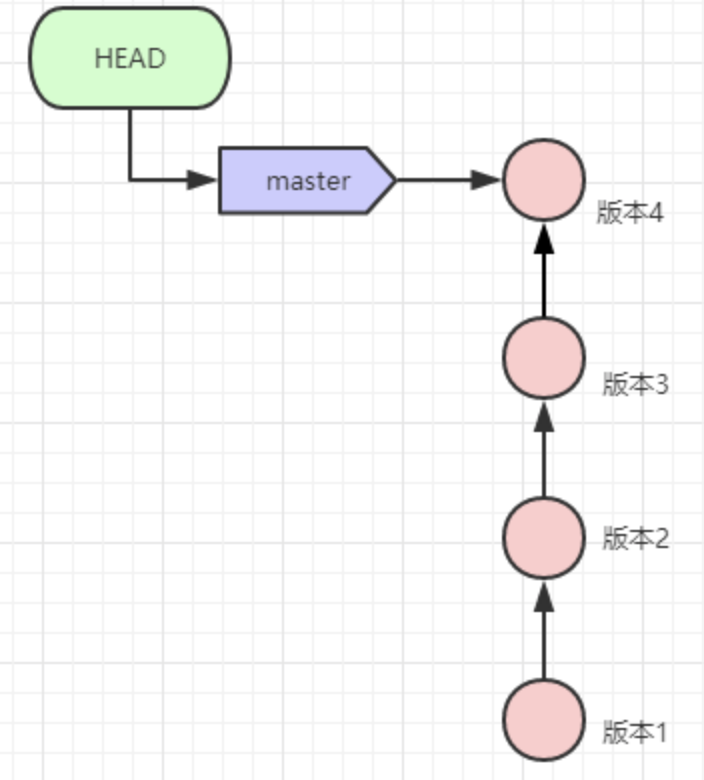
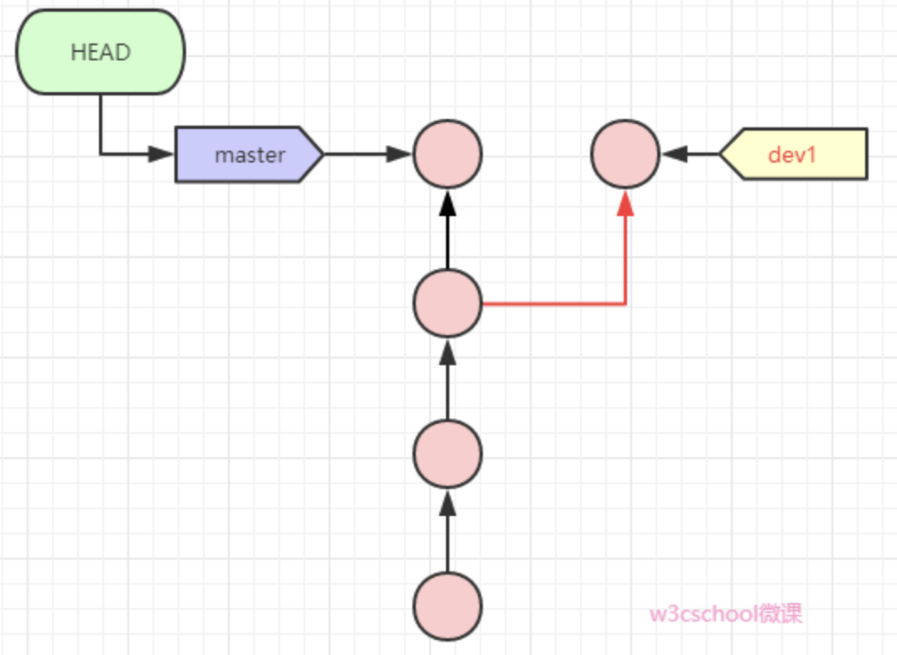
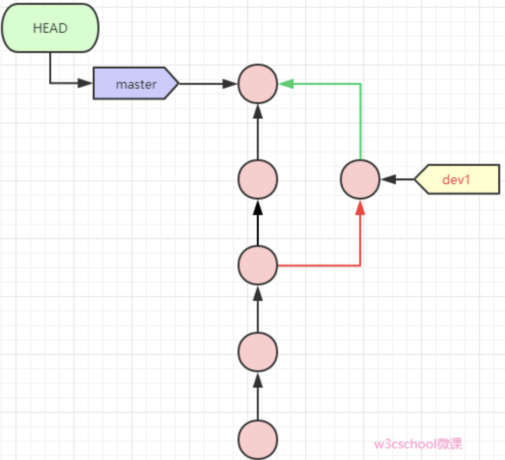
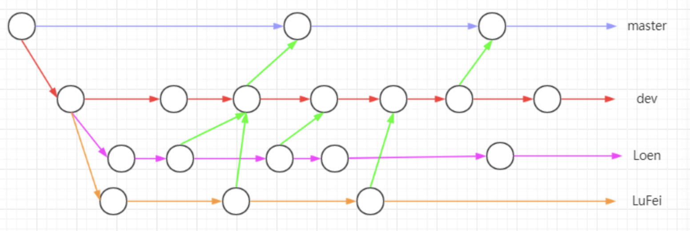

### Git 分支原理

Git 每次提交的版本，Git 都将其串成一条时间线，这条时间线就是一个分支，放你执行 git init 的时候，缺省情况下 Git 就会为你创建“master"分支。HEAD 严格来说不是指向提交，而是指向master，而 master 才是指向提交的，所以，HEAD 指向的就是当前分支。



每次提交，master 分支都会向前移动一步，这样，随着你不断提交，master 分支的线也越来越长。

当我们创建新的分支，如 dev 时，Git 新建了一个指针叫 dev，指向与 master 相同的提交，再把 HEAD 指向 dev ，现在表示当前分支在 dev 上。

如图所示：



我们在 dev 上完成相应的开发后，我们将其合并到 master 分支上，切换回master 分支，如图：



合并完成后，也可以删除 dev 分支，原理是将 dev 指针删除

如图：




### 分支基础命令

```shell
$ git branch 分支名    # 创建分支
$ git checkout -b 分支名       # 创建并切换到新分支
$ git checkout 分支名  # 切换分支命令
$ git merge 分支名     # 将其他分支 合并到当前分支
$ git branch          # 列出分支
* master
	dev
	sta
$ git branch -d 分支名 # 删除指定分支
```


### 解决冲突

我们先创造一个冲突出来，比如，在两个分支中修改了同一个文件的同一行代码，在合并的时候就会发生冲突。

假设我们版本库中有一个 test.py 文件，内容为：

```python
def test():
		print('hello world')
```

我们新建一个分支 dev

```shell
$ git checkout -b dev 
Switched to a new branch 'dev'
```

修改 test.py 为

```python
def test():
		print('hello my girl')
```

在 dev 中提交修改：

```shell
$ git add .
$ git commit "change world to girl"
[dev 591afeb] change world to girl
 1 file changed, 1 insertion(+), 1 deletion(-)
$ git checkout master
```

现在我们切回 master 分支，修改 test.py 为：

```python
def test():
		print('hello my boy')
```

提交修改并合并 dev:

```shell
$ git add .
$ git commit -m "change world to boy"
[master 9b13006] chnage world to boy
 1 file changed, 1 insertion(+), 1 deletion(-)
```

此刻的 master 分支和 dev 分支都有各自新的提交：



然后我们试着合并 dev

```shell
$ git merge dev
Auto-merging test.py
CONFLICT (content): Merge conflict in test.py
Automatic merge failed; fix conflicts and then commit the result.
# 提示我们 test.py 合并冲突，必须手动解决冲突
# 使用 git status 也可以告诉我们存在冲突文件和文件名：
$ git status
On branch master
You have unmerged paths.
  (fix conflicts and run "git commit")
  (use "git merge --abort" to abort the merge)

Unmerged paths:
  (use "git add <file>..." to mark resolution)
	both modified:   test.py

no changes added to commit (use "git add" and/or "git commit -a")
```

我们现在直接看 test.py 文件的内容

```shell
$ cat test.py
def test():
<<<<<<< HEAD
	print('hello my boy')
=======
	print('hello my girl')
>>>>>>> dev
```

Git 用<<<<<<<，======，>>>>>> 标记处不同分支的内容，我们需要修改为：

```python
def test():
		print('hello my boy and girl')
```

然后提交

```
$ git add .
$ git commit -m "conflict fixed"
[master 12283f4] conflict fixed
```

现在 master 分支与 dev 分支变成如图：



我们使用带参数的 git log 也可以看到合并的情况：

```
$ git log --graph --pretty=oneline --abrev-commit
*   31183f4 (HEAD -> master) conflict fixed
|\  
| * 591afeb (dev) change to girl
* | 7e284ba change to boy
|/  
* b852fa5 first
```


### 分支管理策略

通常 Git 在合并分支的时候会用 Fast forward 模式，这样删除分支后，也会丢掉分支信息。

我们在合并分支时可以使用 --no--ff参数，强制禁用 Fastforward 模式，这样 Git 在合并时会生成一个新的 commit，然后我们就可以在历史分支上看出分支信息。

我们来操作下看看效果，我们创建一个dev2的分支

```shell
$ git checkout -b dev2
Switched to a new  branch 'dev2'
```

修改 test.py 文件，然后提交修改：

```shell
$ git add .
$ git commit -m "add a sentence"
[dev2 7fdd00d] add a sentence
 1 file changed, 1 insertion(+)
```

切回 master 分支，然后使用 git merge --no-ff 合并分支

```shell
$ git checkout master
Switched to branch 'master'
$ git merge --no-ff -m "merge with no-ff" dev2
Merge made by the 'recursive' strategy.
 test.py | 1 +
 1 file changed, 1 insertion(+)
```

因为我们禁用 Fast forward 模式，所以本次合并会创建一个新的 commit ，我们用 -m 给这次 commit 加上描述然后我们用 git log 查下分支历史

```shell
$ git log --graph --pretty=oneline --abbrev-commit
*   97d9425 (HEAD -> master) merge with no-ff
|\  
| * 7fdd00d (dev2) add a sentence
|/  
*   31183f4 conflict fixed
...
```

然后删除分支 dev 2，发现 dev 的提交记录依旧在

--no-ff 的功能就是保留旧分支的提交过程。


### 分支策略

在实际开发中，我们应该按照几个基本原则进行分支管理：

首先，master 分支应该是非常稳定的，也就是仅用来发布新分支，平时不要直接在上面开发；

你可以和你团队成员在 dev 上开发，每个人都有自己的分支，然后时不时往 dev 分支上合并，也就是说 dev 分支是不稳定的，等到要发布版本的时候，再将 dev 往master 上合并就可以了，图示如下：




### 多人协作

在实际项目开发中，往往是多人协作开发的，大家通常会往远程的 master 活着 dev 分支上推送各自的修改。

假设你在 dev 分支上对入口文件（比如：index.php）进行修改，而出的队友恰巧也修改了这个文件，并且在你前面推送到远程 dev 分支上。

这时你直接向 dev 推送修改，就会失败，Git 提示我们先用 git pull 把最新的提交从 origin/dev 抓下来，然后，在本地合并，解决冲突（如果有冲突的话），再推送：

```shell
$ git pull
```

如果你没有指定关联 dev 分支与远程 origin/dev 分支的链接，git pull 会失败，这时要先设置下 dev 和 origin/dev 的链接：

```shell
$ git branch --set-upstream dev /origin/dev
Branch dev set up to track remote branch dev from origin.
```

然后再pull下来就可以了

如果 pull 下来，提示有冲突就可以按照之前的课程解决冲突，再 push 就可以了

```apl
多人协作的工作模式通常是这样的：
	1. 首先，用 git pull 看看有没有人在远程提交代码，有的话将其合并到本地；
	2. 如果合并有冲突，则解决冲突，并在本地提交；
	3. 没有冲突活着解决掉冲突后，再用 git push origin name 推送就能成功！
```

