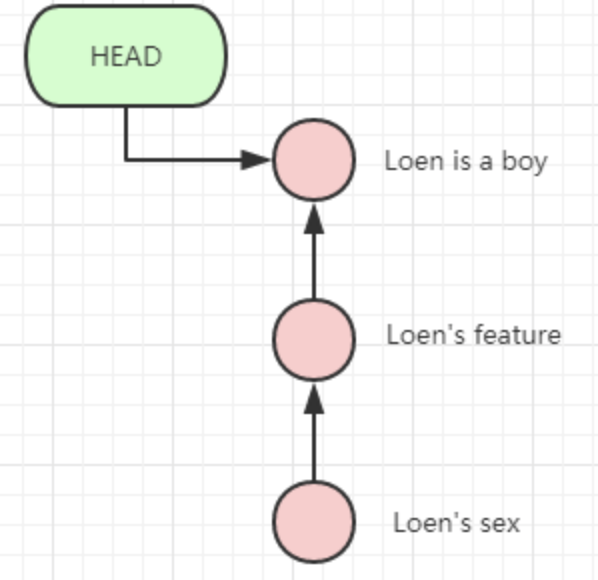
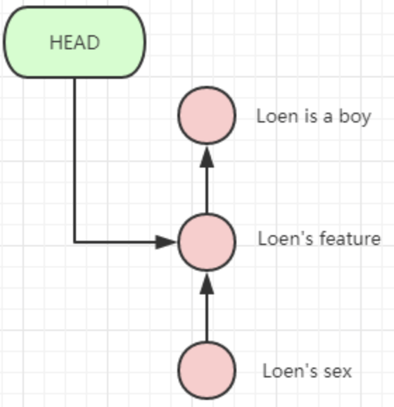

### 撤销修改（git checkout -- file）

命令 git checkout -- 文件 意思就是，把 该文件 在工作区的修改全部撤销

```apl
$ git checkout -- <file>
1. 如果文件修改后还没有放到暂存区
   那么撤销修改就是用版本库的版本覆盖当前的文件。
2. 如果文件已经添加到暂存区，又作了想修改
	 那么撤销修改就是将暂存区中的文件版本覆盖当前的文件。
```

总之，就是让这个文件回到最近一次 git commit 或  git add 的状态。


### 历史记录（git log）

如果嫌 git log 输出信息太多，可以加上 --pretty=oneline 参数：

```shell
$ git log --pretty=oneline
97d9425f82356e37664834ca811b70a89df1d02f (HEAD -> master) merge with no-ff
7fdd00d17867d7264eb59b43c9831174176f2ae7 add a sentence
31183f42c4b66cda3b15cab95a3039171dc5e8e8 conflict fixed
7e284ba71a322fc7e3816da10527686748480767 change to boy
591afeb1106ffe5023373d6fe6ff26ace3bd1530 (dev) change to girl
b852fa53a72c91f1d1548c3186dfa9c9a212b3ee first
```

```apl
1. 为什么 commit ID 需要这么一大串数字表示呢？
		因为 Git 是分布式的版本控制系统，当多人在同一个版本库里工作，如果大家都用1，2，3...作为版本号，那肯定会发生冲突。
```


### 版本回退（git reset）

要把当前版本回退到上一个版本，可以使用 git reset 命令。

```shell
$ git reset --hard HEAD^   #回到上一个版本
#在 Git 中，用 HEAD 表示当前版本，上一个版本就是 HEAD^或HEAD~，更前的可以表示为 HEAD~n 或 HEAD^n
```

Git 的版本回退速度非常快，因为 Git 内部有个指向当前版本的 HEAD 指针，当你回退版本的时候，Git 仅仅是把 HEAD 从指向 Loen is a boy:



改为指向 Loen's feature 



然后把工作区的文件更新了。所以你让 HEAD 指向那个版本号，就把当前版本定位在哪。


如果回退失误，想要改回原来的 Loen is a boy 版本，就必须找到 loen is a boy 的 commit id.

Git 提供了一个命令 git reflog 用来记录你的每一次命令：

```shell
$ git reflog
ab1ca2b HEAD@{0}: reset: moving to HEAD^
a9c230a HEAD@{1}: commit: Loen is a boy
ab1ca2b HEAD@{2}: commit: Loen's feature
e871a66 HEAD@{3}: commit: Loen's sex
38255de HEAD@{4}: commit: rm test.txt
f3476aa HEAD@{5}: commit: init test.txt
15492c1 HEAD@{6}: commit (initial): create test.php
```

我们可以看到 Loen is a boy 的 commit id 为a9c230a

```shell
$ git reset --hard a9c230a
HEAD is now at a9c230a Loen is a boy
$ git log --pretty=oneline
a9c230a8be2d3cacdb0909a43 Loen is a boy
ab1ca2bc153c7a94daaa6a546 Loen's feature
e871a660e7c4f6d03d67e69e0 Loen's sex
38255deef96d7eeb3d58edf0d rm test.txt
f3476aac14d3d297ded5f89d5 init test.txt
15492c1f537b1abedfb5db8ec create test.php
```

git reset --hard 后也可以指定 commit id 切换到指定版本

git reflog: 显示整个本地仓库的 commit，包括 所有分支的 commit，甚至包括已经撤销的commit，只要HEAD 发生了变化，就会在 reflog 里面看到。